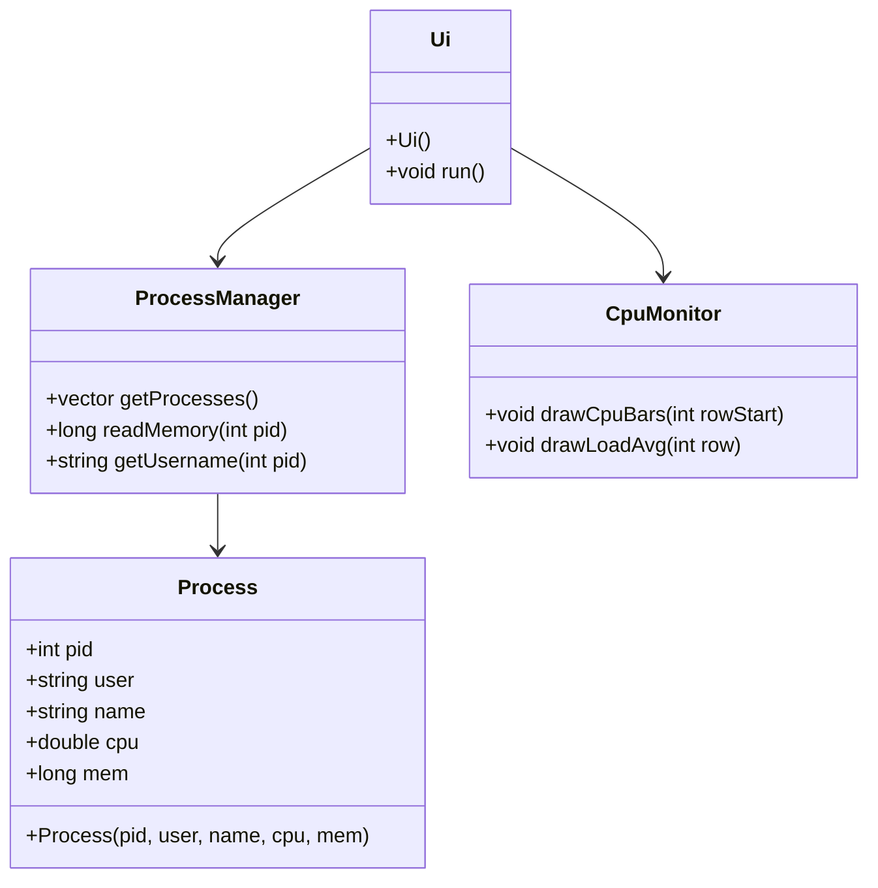

# **Software Design and Implementation**

Este documento describe la arquitectura, funcionamiento y uso de cada componente del proyecto Villain Of Process.

## Diagrama UML de Clases


## Explicación de Clases y Archivos
### 1. Process
Representa un proceso del sistema.

**Atributos:**

**pid:** Identificador del proceso.
**user:** Usuario propietario.
**name:** Nombre del proceso.
**cpu: **Uso de CPU.
**mem: **Memoria utilizada.

Ejemplo de uso:

````cpp
Process p(1234, "StrangeKode", "bash", 0.5, 2048);
````

**2. ProcessManager**

Gestiona la obtención y procesamiento de procesos.

**Métodos:**

**getProcesses():** Devuelve la lista de procesos.

**readMemory(pid):** Devuelve la memoria usada por un proceso.

**getUsername(pid):** Devuelve el usuario propietario.

Ejemplo de uso:

````cpp
ProcessManager pm;
std::vector<Process> procs = pm.getProcesses();
````

**3. CpuMonitor**

Monitorea y muestra gráficamente el uso de CPU.

**Métodos:**

**drawCpuBars(rowStart):** Dibuja barras de CPU en la interfaz.

**drawLoadAvg(row):** Dibuja el promedio de carga en la interfaz.


Ejemplo de uso:

````cpp
CpuMonitor cpu;
cpu.drawCpuBars(0);
cpu.drawLoadAvg(5);
````

**4. Ui**

Gestiona la interfaz de usuario y la interacción entre componentes.

**Métodos:**

**Ui():** Constructor que inicializa la interfaz.

**run():** Inicia el bucle principal de la interfaz.

Ejemplo de uso:

````cpp
Ui ui;
ui.run();
````

## Flujo General del Programa
- main.cpp crea una instancia de Ui y llama a run().
- Ui inicializa ncurses y muestra la información de CPU y procesos.
- CpuMonitor dibuja las barras de CPU y la carga promedio.
- ProcessManager obtiene la lista de procesos y sus datos.
- El usuario navega, selecciona y puede finalizar procesos.

**Dependencias**
ncurses: Interfaz gráfica en terminal.
C++17: Estándar mínimo.

**Extensibilidad**
La arquitectura orientada a objetos permite agregar nuevas funcionalidades fácilmente, como filtros, ordenamientos, o nuevas métricas.
